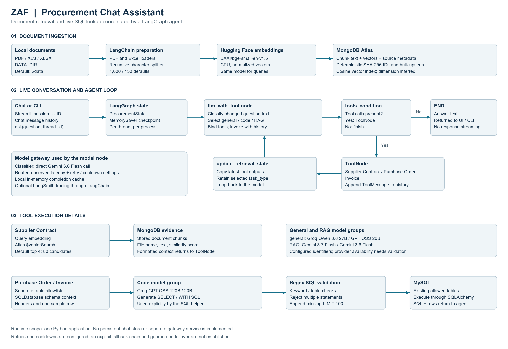

# ZAF – Procurement Chat Assistant

**An AI procurement assistant that combines supplier-document retrieval with live purchase-order and invoice lookups.**

ZAF brings two common procurement information sources into one conversational interface: contracts and policies stored as documents, and operational records stored in MySQL. A LangGraph agent chooses the relevant tool, receives evidence, and generates a natural-language answer. A Streamlit chat interface maintains the conversation within a browser session.

The engineering work spans document ingestion, vector search, natural-language-to-SQL, tool orchestration, conversation state, model routing, caching, and tracing. This is an implemented development project; no accuracy, latency, cost, or business-impact benchmarks are claimed.

[Detailed architecture document](ZAF_Procurement_Chat_Assistant_Architecture.docx) · [Full-resolution architecture diagram](ZAF_Architecture_Diagram.png)

## What ZAF does

| Capability | Procurement application | Implementation |
| --- | --- | --- |
| Supplier Contract tool | Find relevant payment terms, contract clauses, or policy passages | Hugging Face query embeddings and MongoDB Atlas Vector Search |
| Purchase Order tool | Look up orders in configured purchase-order tables | Schema-aware SQL generation, validation, and MySQL execution |
| Invoice tool | Retrieve invoice details from configured invoice tables | Separate table allowlist using the same SQL helper |
| Conversation memory | Ask follow-up questions in the same running session | `ProcurementState`, `MemorySaver`, and `thread_id` |
| Model gateway | Assign different models to conversation, RAG, and code tasks | LiteLLM Router wrapped by `ChatLiteLLMRouter` |
| Trace integration | Inspect graph, tool, and LLM activity when enabled | Environment-backed LangSmith configuration |

These workflows can reduce the need to switch between document search and database queries. Their usefulness depends on the indexed documents, database schema, model access, and answer quality; ZAF does not create orders, approve invoices, or reconcile payments automatically.

## Architecture



The offline pipeline stores document text, vectors, and metadata in Atlas. At runtime, `ask(question, thread_id)` invokes the checkpointed graph. Its model node classifies the latest question when its text changes, selects a model group, and binds all three tools. Tool results return to the model through message history. MySQL tables are queried live; they are not embedded by this pipeline.

The gateway runs inside the Python application. There is no separately deployed LiteLLM proxy, API server, or multi-agent hierarchy in the current implementation.

## Technology and AI implementation

| Area | Active implementation |
| --- | --- |
| Application | Python; Streamlit chat UI; CLI entry points |
| Agent orchestration | LangGraph `StateGraph`, `ToolNode`, `tools_condition`, `MemorySaver` |
| LLM integration | LangChain messages/tools; `langchain-litellm`; LiteLLM; Groq and Gemini APIs |
| Document loading | LangChain Community `PyPDFLoader`, `UnstructuredExcelLoader` |
| Chunking | `RecursiveCharacterTextSplitter`; defaults: 1,000 characters and 150-character overlap |
| Embeddings | `HuggingFaceEmbeddings`; default `BAAI/bge-small-en-v1.5`; CPU execution; normalized vectors |
| Vector store | PyMongo; MongoDB Atlas `$vectorSearch`; cosine vector index |
| Structured retrieval | LangChain `SQLDatabase`, SQLAlchemy, PyMySQL; MySQL |
| Configuration and tracing | `python-dotenv`, frozen `Settings` dataclass, LangSmith |
| Dependency management | `pyproject.toml` and `uv.lock` |

**RAG:** retrieved document chunks become evidence in `ToolMessage` history before answer generation. The contract tool formats file names and similarity scores; it does not enforce final-answer citations.

**Embeddings and chunking:** the splitter is character-based, not a Hugging Face chunking model. Hugging Face supplies the embedding model. Ingestion and query retrieval use the same configured model.

**Prompt engineering:** separate prompts define procurement tool selection, task classification, and SQL constraints. The SQL prompt includes headers/schema and one sample row per allowed table.

**Agent behavior:** the answer model can invoke a tool, inspect its result, and request another tool before finishing. Classification is a model-selection step inside the model node, not a separate graph node.

### Configured model routes

These are identifiers in `scr_code/llm_gateway.py`, not a statement that every provider account supports them. Confirm model availability and tool-calling support before a live run.

| Purpose | Configured provider model identifiers |
| --- | --- |
| Classifier, direct `ChatLiteLLM` call | `gemini/gemini-3.6-flash` |
| `general` group | `groq/qwen/qwen3.8-27b`; `groq/openai/gpt-oss-20b` |
| `code` group | `groq/openai/gpt-oss-120b`; `groq/openai/gpt-oss-20b` |
| `RAG` group | `gemini/gemini-3.7-flash`; `gemini/gemini-3.6-flash` |

The router uses `routing_strategy="latency-based-routing"`, `cache_responses=True`, `num_retries=1`, `allowed_fails=1`, and `max_fallbacks=1`. Calls pass `caching=True`, backed by `Cache(type="local")`. Cache data lives in process memory and is lost on restart. Latency routing depends on observed deployment timings; list order does not establish a primary/backup preference.

**Reliability boundary:** retry/cooldown settings are present, but no explicit `fallbacks` mapping or deployment priority is configured. Guaranteed switching on every error is not established. The GPT OSS 20B deployment ID is reused in two groups. The classifier bypasses the Router and returns `RAG` on an invocation exception or invalid label; its first call can precede local-cache initialization.

## End-to-end workflow

1. Streamlit generates a UUID thread ID and stores displayed messages in session state. It calls the existing `ask()` function.
2. LangGraph loads the in-process checkpoint for that thread and adds the human message.
3. If the question text differs from `current_question`, the classifier returns `general`, `code`, or `RAG`. Otherwise the saved route is reused.
4. `get_routed_llm(task_type).bind_tools(tools)` invokes the selected model group with the system prompt and conversation history.
5. A direct answer ends the graph. A tool call is dispatched to Supplier Contract, Purchase Order, or Invoice.
6. Supplier Contract embeds the query and retrieves four Atlas matches by default, with `numCandidates = limit * 20`.
7. A MySQL tool collects allowed-table schema and one sample row, calls the `code` route, validates SQL, and executes it. The result includes SQL and database output.
8. Tool messages update `retrieved_context`, `tool_context`, and `retrieval_count`. The agent loops back to its saved model group until it answers.

## Project structure

Paths below refer to the project root, not this documentation directory.

```text
Procurement_bot/
├── app.py                       Streamlit interface and session history
├── main.py                      One-question CLI wrapper around ask()
├── scr_code/
│   ├── config.py                Environment settings and LangSmith variables
│   ├── ingest.py                Load, split, embed, upsert, create index
│   ├── retrieve.py              Query embedding and Atlas vector search
│   ├── llm_gateway.py           Model groups, classifier, cache, router
│   ├── mysql_lookup.py          SQL prompt, allowlist validation, execution
│   ├── procurement_graph.py     Tools, state, checkpointing, agent loop
│   └── __init__.py              Package marker
├── data_source/                 Existing PDF and XLSX source directory
├── .env.example                 Partial environment template
├── pyproject.toml               Main dependency declarations
├── uv.lock                      Resolved dependency versions
├── requirements.txt             Alternate list with duplicates and omissions
├── test.ipynb                   Experimentation notebook, not a test suite
└── documentation_output/        Separately generated documentation
```

ChromaDB and standalone provider wrappers are declared dependencies but are not the active storage or model-call paths. The production entry points do not import the experimentation notebook. No `google_llm.py` is present in the analyzed source package.

## Installation and setup

### Verification scope

The source and lockfile were reviewed on 20 September 2026. All nine application Python files pass AST syntax parsing. The ingestion, retrieval, graph, and `main.py` entry points load successfully with `--help`. The existing environment reports Python 3.14.6, LiteLLM 1.100.1, langchain-litellm 0.7.0, LangChain 1.3.14, LangGraph 1.2.9, and Streamlit 1.61.1. The project declares Python >=3.12 and pins 3.14 in `.python-version`.

Commands below match the implemented entry points. Provider calls, database connectivity, document ingestion, and a clean-machine installation require your own environment and have not been certified by these local checks.

### 1. Install dependencies

From the project root, with `uv` installed:

```powershell
uv sync --locked
```

Use the lockfile-backed installation for reproducibility. The alternate `requirements.txt` repeats several entries and omits Streamlit; it is not an equivalent setup path. The existing environment's import check can be reproduced without making provider requests:

```powershell
uv run --frozen python -m scr_code.ingest --help
uv run --frozen python -m scr_code.retrieve --help
uv run --frozen python -m scr_code.procurement_graph --help
uv run --frozen python -m streamlit --version
```

### 2. Configure services and local variables

Create or edit your private `.env` at the project root. Preserve any existing values. `.env.example` is incomplete for the gateway: add `GROQ_API_KEY` and the LangSmith variables explicitly. The following values are placeholders, not working credentials or a supplied database schema.

```dotenv
GOOGLE_API_KEY=<your-google-key>
GROQ_API_KEY=<your-groq-key>
LANGSMITH_API_KEY=<your-langsmith-key>
LANGSMITH_TRACING=false
LANGSMITH_PROJECT=procurement-chatbot

MONGODB_URI=<your-atlas-connection-string>
MONGODB_DATABASE=procurement_bot
MONGODB_COLLECTION=documents
MONGODB_VECTOR_INDEX=vector_index
EMBEDDING_MODEL=BAAI/bge-small-en-v1.5
DATA_DIR=./data_source
CHUNK_SIZE=1000
CHUNK_OVERLAP=150

MYSQL_URI=mysql+pymysql://<read-only-user>:<url-encoded-password>@<host>:3306/<database>
MYSQL_PURCHASE_ORDER_TABLES=<actual-po-table>,<actual-po-lines-table>
MYSQL_INVOICE_TABLES=<actual-invoice-table>,<actual-invoice-lines-table>
```

- `Settings.from_environment()` requires both `MONGODB_URI` and `LANGSMITH_API_KEY`, even with tracing disabled or a MySQL-only question. Set `LANGSMITH_TRACING=true` to enable trace export.
- Configure Atlas network access, database access, and privileges for search-index creation. MySQL tables must already exist; this repository has no schema migration or database seed pipeline.
- The MySQL URI must select the PyMySQL driver. Percent-encode reserved characters in credentials and grant the database user read-only permissions.
- The default data path is `./data`, while the repository's source folder is `data_source`; set `DATA_DIR` accordingly.
- Gateway model IDs are defined in Python. The `GOOGLE_MODEL` entry in the legacy template does not change these routes.
- Initial embedding use may download model weights. PDF text extraction has no explicit OCR stage; scan-only files may need preprocessing. Excel parser dependencies can vary for legacy `.xls` inputs.

### 3. Ingest supplier documents

```powershell
uv run --frozen python -m scr_code.ingest
```

Ingestion recursively discovers PDF/XLS/XLSX files, loads and splits their text, embeds all chunks, and bulk-upserts Atlas records. It creates the vector index if absent and infers its dimensions from the embedding model. Wait until the Atlas index is queryable before testing retrieval; the script does not poll index readiness. `--skip-index` skips index creation only.

Repeated identical ingestion uses deterministic IDs. Editing, moving, deleting, or reordering source chunks can leave old records; this is not a complete synchronization/deletion pipeline.

### 4. Run the assistant

```powershell
uv run --frozen streamlit run app.py
```

For a single CLI question:

```powershell
uv run --frozen python main.py --thread-id demo-thread "Summarize the payment terms for Example Supplier."
```

For vector retrieval without answer generation:

```powershell
uv run --frozen python -m scr_code.retrieve "supplier payment terms" --limit 4
```

Separate CLI processes do **not** share `MemorySaver` state, even with the same thread ID. For a continuing conversation, use Streamlit or repeated `ask(question, thread_id)` calls within one Python process.

## Illustrative usage

These examples describe supported question types; they are not actual query results, benchmark cases, or promises about your schema.

- “What payment terms are recorded for Example Supplier?” → Supplier Contract retrieval when matching source documents exist.
- “Show open purchase orders for Example Supplier.” → Purchase Order lookup if the allowed schema contains suitable supplier/status fields.
- “Which invoices for that supplier remain unpaid?” → Invoice lookup, with the prior conversation available to the answer model.
- “Write a SELECT query to count orders by status.” → Classified as a code task; generated content still depends on available context.

## Engineering choices and limitations

- **Evidence and provenance:** chunks retain source path, file name, file type, and global chunk number. Source sections are provided to the model, but citation correctness is not validated.
- **SQL constraints:** the validator rejects common write keywords, comments, multiple statements, and detected tables outside the allowlist. It appends `LIMIT 100` if no numeric limit is present. Regex validation is not a SQL security boundary; CTEs and complex queries have gaps, and an existing larger limit is not capped.
- **State and routing:** checkpoint memory and LiteLLM cache are separate in-process mechanisms. There is no durable history, context trimming, authentication, or per-user authorization layer. The classifier sees the latest question only, although the answer model sees the conversation.
- **Retrieval quality:** no reranker, metadata filter, score threshold, or retrieval evaluation suite is implemented. Embedding models and MongoDB clients are recreated per retrieval call.
- **Reliability:** same-group deployments and retry settings do not prove guaranteed fallback on every provider error. There are no fault-injection tests or model-availability checks in the repository.
- **Operations:** ingestion loads all documents and vectors in memory. Index readiness, stale records, schema changes, and production query budgets need lifecycle handling.
- **Data handling:** prompts can contain document excerpts, database sample rows, SQL results, and conversation history. Enabling LangSmith sends trace data externally. Review data permissions before using real procurement records; UI exceptions currently expose technical details.

### Realistic next steps

1. Add mocked graph/router tests and retrieval/SQL answer evaluations using non-confidential fixtures.
2. Configure explicit fallback policies, unique deployment IDs, provider capability checks, and failure monitoring.
3. Introduce a durable checkpointer, context management, authentication, and source-level access rules.
4. Replace regex-only SQL validation with parser-based checks plus database read-only roles, enforced limits, and timeouts.
5. Add incremental ingestion cleanup, batched processing, index-readiness checks, embedding reuse, and retrieval filters.
6. Consolidate dependency manifests and complete the environment template; measure answer quality and latency before making performance claims.

## Detailed documentation

The [seven-page architecture brief](ZAF_Procurement_Chat_Assistant_Architecture.docx) explains the project design, AI concepts, model mappings, modules, workflow, and practical value. This README and its companion PNG/DOCX are intentionally packaged together in a separate output directory so the existing project README and code are preserved.
